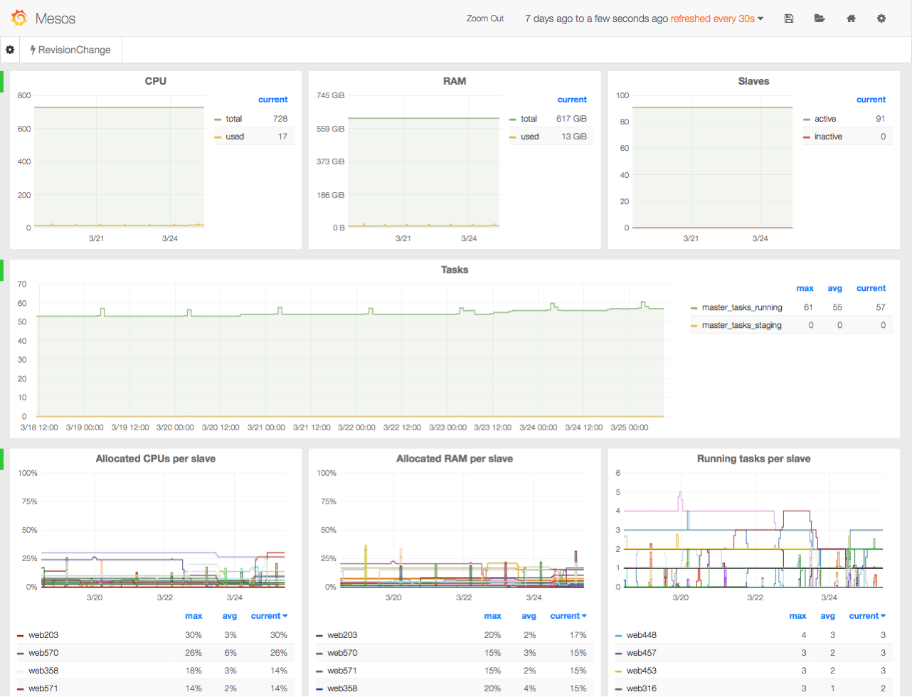

# Collect mesos metrics to graphite

This is dockerized version of [collectd-mesos](https://github.com/rayrod2030/collectd-mesos).
You only need docker to run this, mesos to monitor and graphite to store metrics.

## Running

### Master

```
docker run -d -e GRAPHITE_HOST=<graphite host> -e MESOS_MODE=master \
    -e MESOS_HOST=<mesos host> -e MESOS_PORT=<mesos port> \
    -e MESOS_VERSION=<mesos version> bobrik/collectd-mesos
```

### Slave

```
docker run -d -e GRAPHITE_HOST=<graphite host> -e MESOS_MODE=slave \
    -e MESOS_HOST=<mesos host> -e MESOS_PORT=<mesos port> \
    -e MESOS_VERSION=<mesos version> bobrik/collectd-mesos
```

### Environment variables

* `COLLECTD_HOST` - host to use in metric name, defaults to the value of `MESOS_HOST`.
* `GRAPHITE_HOST` - host where carbon is listening for data.
* `GRAPHITE_PORT` - port where carbon is listening for data, `2003` by default.
* `GRAPHITE_PREFIX` - prefix for metrics in graphite, `collectd.` by default.
* `INFLUXDB_HOST` - host where influxdb is listening for data.
* `INFLUXDB_PORT` - port where influxdb is listening for data, `25826` by default.
* `MESOS_MODE` - mesos node type: `master` or `slave`.
* `MESOS_HOST` - mesos host to monitor.
* `MESOS_PORT` - mesos port number, likely `5050` for master and `5051` for slave.
* `MESOS_VERSION` - mesos version to enable version-specific metrics.

Note that this docker image is very minimal and libc inside does not
support `search` directive in `/etc/resolv.conf`. You have to supply
full hostname in `MESOS_HOST` that can be resolved with nameserver.

## Grafana dashboard

Get example [grafana dashboard](grafana-dashboard.json):



# Authors

* [Ian Babrou](https://github.com/bobrik)
